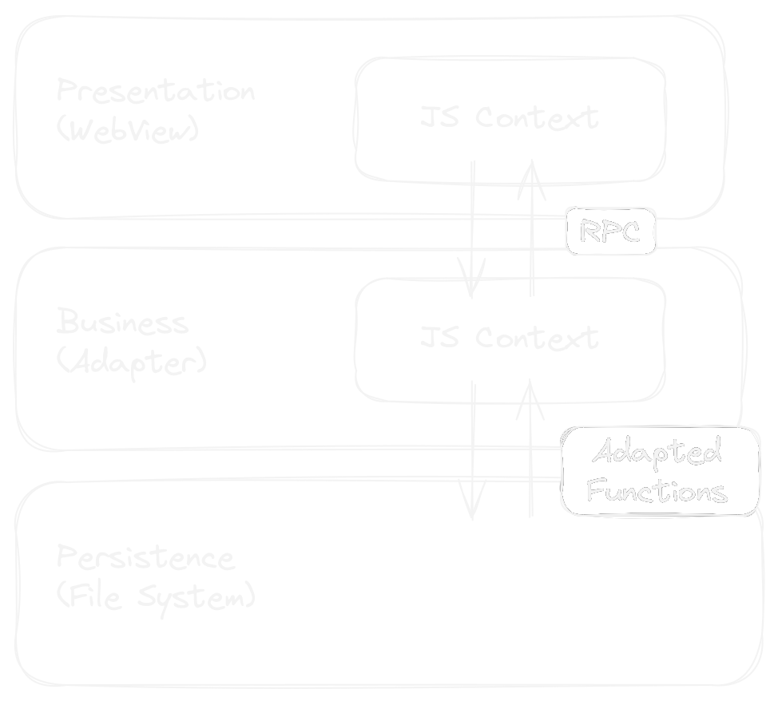
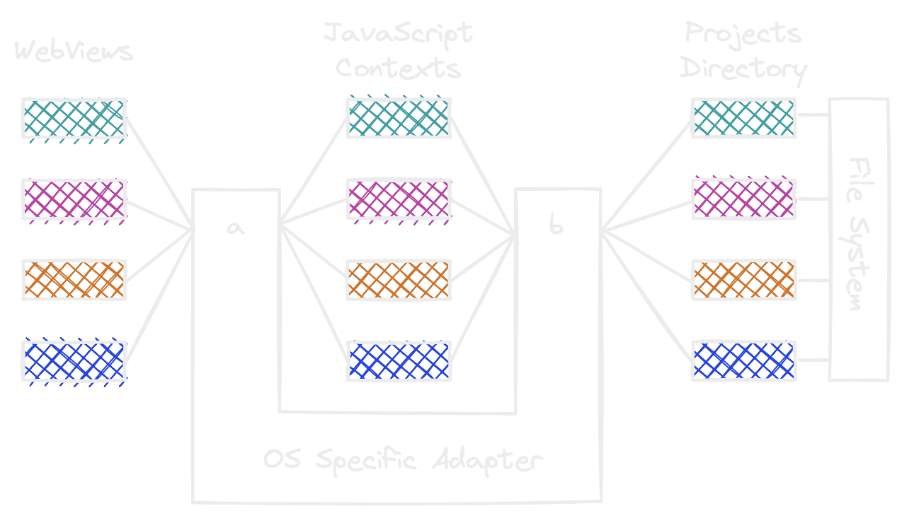

# FullStacked Editor

Build and run full-stack JavaScript web apps on any platform.

## Motivation

Building applications is so much fun. But deployment and distribution is way less.
There are 2 major ways to distribute an app nowadays:
* Making the app available on an App Marketplace (Apple App Store, Google Play Store, etc.)
* Deploying on a web server/hosting service (CloudFlare, Vercel, Netlify or any Cloud Provider like AWS, Azure, etc.)

Both cases brings tedious tasks like apps reviews or needing to build out of scope functionalities like logins, rate limiters, cache busters, etc.
What if we just want to use our quick and small JavaScript app throughout all of our devices without the need to go through any of that?

This project aims to provide a way to build at a very high pace and run full-stack web applications on any device.

## How it works

> This section explains in-depth how FullStacked is able to easily run full-stack JS web apps anywhere.  
> If you are looking for help on how to build an app inside FullStacked, go over the Guides section.

There are 4 key components in FullStacked

* WebView
  * Let's take advantage of what has been rendering interfaces for years: the web browser.  
    Some even argue it's better than native rendering.   
    [I Replaced My Native iOS App with a Cross-Platform Web App and No One Noticed](https://medium.com/javascript-in-plain-english/i-replaced-my-native-ios-app-with-a-cross-platform-web-app-and-no-one-noticed-1653901ce244)
* JavaScript Engine
  * Here we're talking **engine**, like V8, JavaScript Core and SpiderMonkey.
* [esbuild](https://esbuild.github.io)
  * An incredibly fast bundler to merge into one file (to bundle) all of your messy JS files.
  * It also transforms JSX and TypeScript into JS
* Adapter
  * A piece of code that translates the JavaScript OS-level calls to the platform behind.

Here's an example of how these components interact

This architecture is thought to make it as easy as possible to implement it onto any kind of device.

### Implementation examples

#### iOS/iPadOS

* Webview: WKWebView
* JavaScript Engine: Built-in JavaScript Core
* Esbuild: GO library built to C-archive
* Adapter: Swift

#### Electron (MacOS, Windows, Linux)

* Webview: Chrome (from Electron)
* JavaScript Engine: V8 (from NodeJS from Electron)
* Esbuild: OS specific prebuild downloaded on first run
* Adapter: NodeJS (from Electron)

### The two JS contexts

If you ever built web applications, you are probably familiar with the frontend-backend (client-server) concept.
If you used NodeJS for the backend/server part, you had 2 JS contexts:
* One on the frontend/client, that renders the UI
* One on the backend/server, which holds the business logic
  
The two most probaly communicated through an API.

Building apps in FullStacked keeps this same approach, but in a much simpler/abstracted way.
You can build an api to extend some OS-level functionalities and easily access them from the webview through
an object called `rpc`.

This way, we make sure apps works both locally and remotely.
Learn more about how to build the API JS and use the RPC object in the Guides section.

### Multiple apps in parallel

To prevent opening ports, while keeping the same frontend-backend concept,
the communication between the webviews and the instances of javascript engine is done in different ways.

* **a**: The webviews requests are untangled
  * Swift: A class that extends `WKURLSchemeHandler` is set for the `fs` scheme protocol. Then each webview uses this scheme instead of `http` and has its own instance of this class.
  * Electron: The `http` protocol is overriden and each webview uses a different hostname.
  * NodeJS: Runs every web app on a different port.
* **b**: Each individual app is limited to it's own directory.
