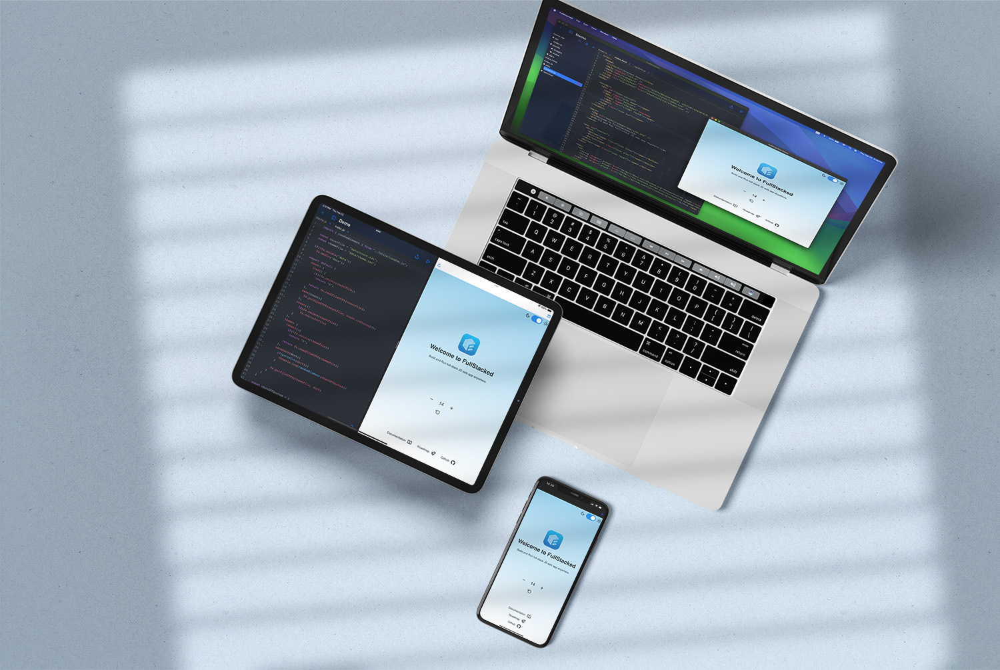
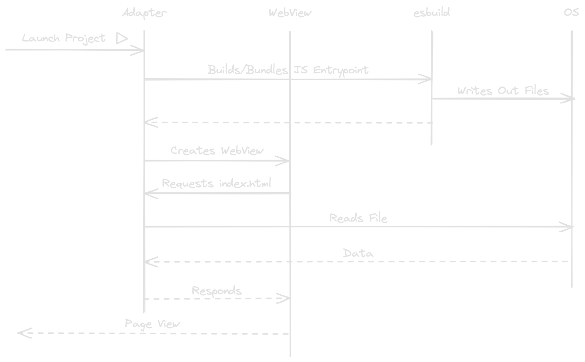

# FullStacked Editor

Build and run JavaScript web apps on any platform.

## Motivation

Building applications is so much fun. But deployment and distribution is way less.
There are 2 major ways to distribute an app nowadays:

* Make the app available on App Marketplaces (Apple App Store, Google Play Store, Microsoft Store, Meta Store, etc.)

or

* Deploy on the public web
    * Hosting a web server with a cloud provider (AWS, Azure, Google, etc.) or your own
    * Using a hosting service (CloudFlare, Vercel, Netlify, etc.)

Both cases brings tedious tasks like apps reviews or needing to build out of scope functionalities like logins, rate limiters, cache busters, etc.
What if we just want to use our quick and small JavaScript app throughout all of our devices without the need to go through any of that?

This project aims to provide a way to build at a very high pace and run full-stack web applications on any device.

## How it works

> This section explains in-depth how FullStacked is able to easily run full-stack JS web apps anywhere.  
> If you are looking for help on how to build an app inside FullStacked, go over the Guides section.

There are 3 key components in FullStacked

* WebView
  * Let's take advantage of what has been rendering interfaces for years: the web browser.  
    Some even argue it's better than native rendering.   
    [I Replaced My Native iOS App with a Cross-Platform Web App and No One Noticed](https://medium.com/javascript-in-plain-english/i-replaced-my-native-ios-app-with-a-cross-platform-web-app-and-no-one-noticed-1653901ce244)
* [esbuild](https://esbuild.github.io)
  * An incredibly fast bundler to merge into one file (to bundle) all of your messy JS files.
  * It also transforms JSX and TypeScript into JS
* Adapter
  * A platform specific piece of code that exposes some OS-level functionalities to your JavaScript.

Here's an example of how these components interact

This architecture is thought to make it as easy as possible to implement it onto any kind of device.

### Implementations

#### iOS

WebView: WKWebView  
esbuild: GO library built to c-archive
Adapter: Swift

#### electron

WebView: Chrome (Packed with electron)  
esbuild: Prebuilt binary downloaded on first run  
Adapter: NodeJS (Packed with electron)

#### npm

WebView: Your default web browser  
esbuild: Install through npm dependencies  
Adapter: NodeJS

## FullStacked vs PWA

Progressive Web Apps are very close to what you'll build in FullStacked.
Although, adding a project to FullStacked is through git or offline processes, 
meaning your projects are not exposed to the public internet.
Also, FullStacked provides an easy access to native functionalities like the file system and a native fetch (no CORS).

## FullStacked vs React-Native/Flutter

The goal of those frameworks is to translate to OS-specific native features. 
FullStacked is more of an environment that provides those features and gives an universal way to access them from a webview.
In other words, RN/Flutter translates your codebase when built/compiled vs FullStacked is a prebuilt environment ready to run any web apps.

## FullStacked vs Electron/Tauri/Neutralinojs

Those frameworks are designed to pack your JavaScript with a webview and a runtime. 
FullStacked exists to provide everyone with those two same components in a stable way. 
Meaning, all you have left to do is build and run projects, no need to pack anything else.
