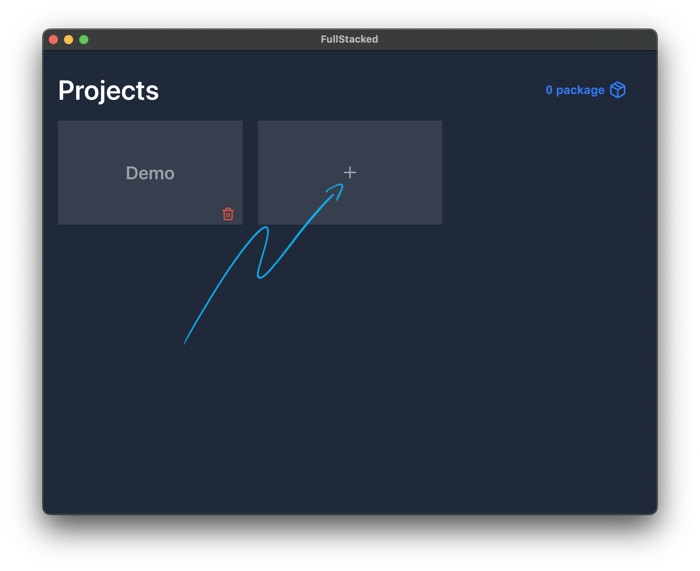
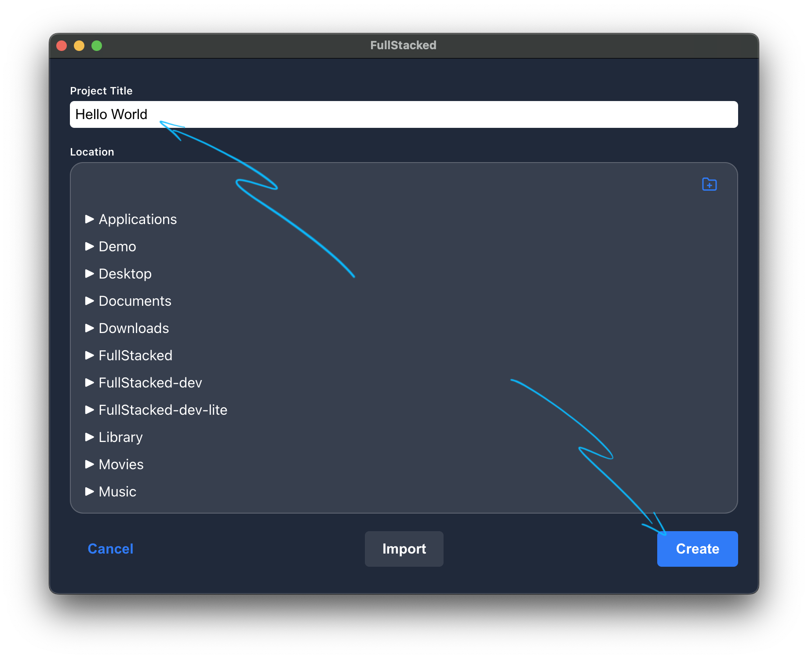
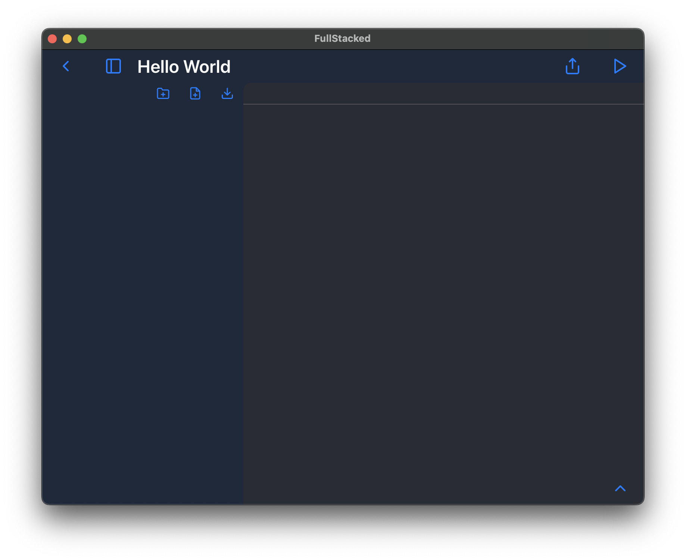
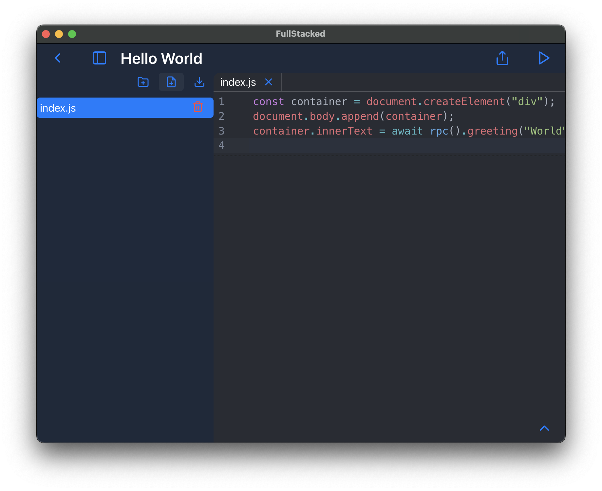
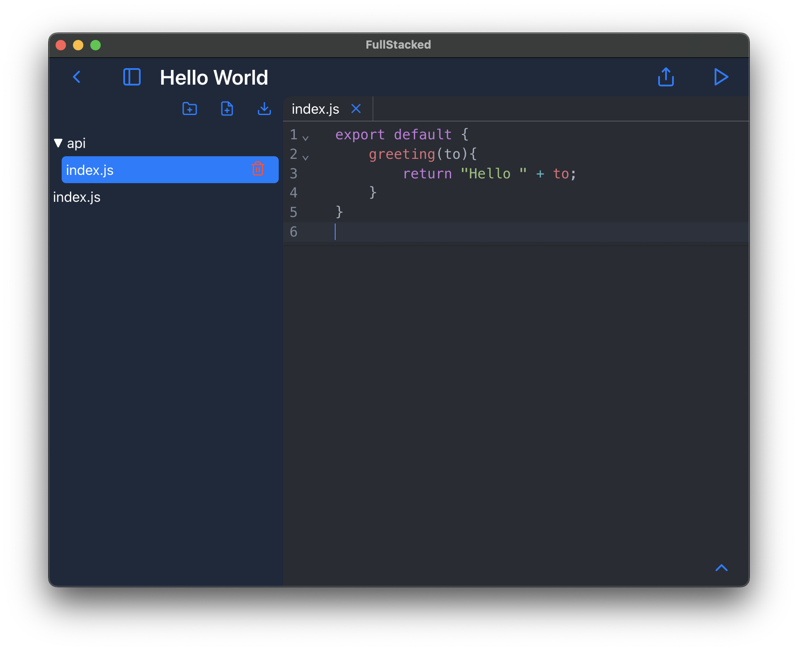
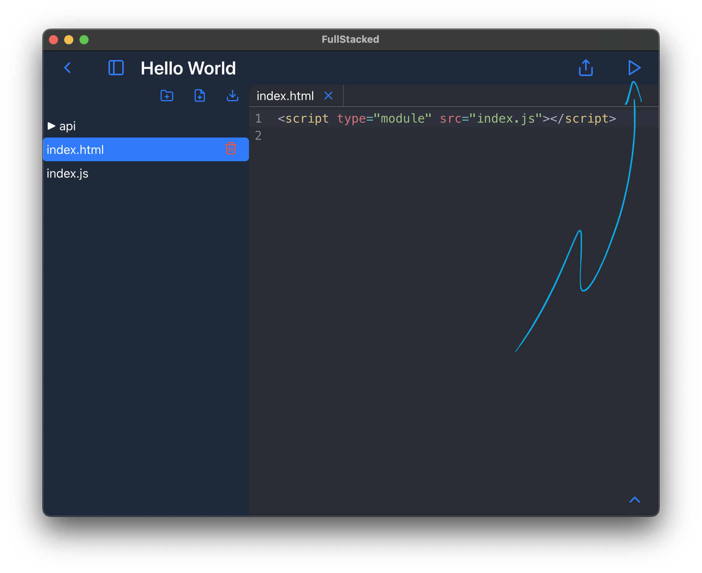
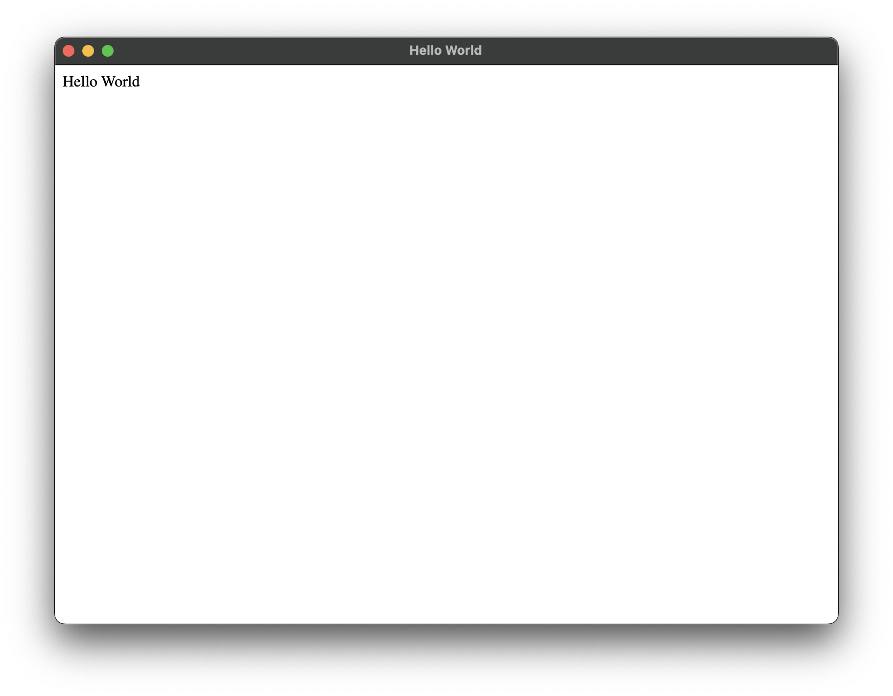
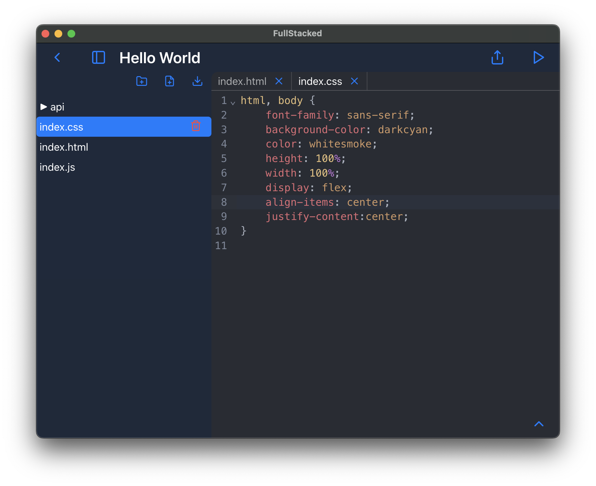
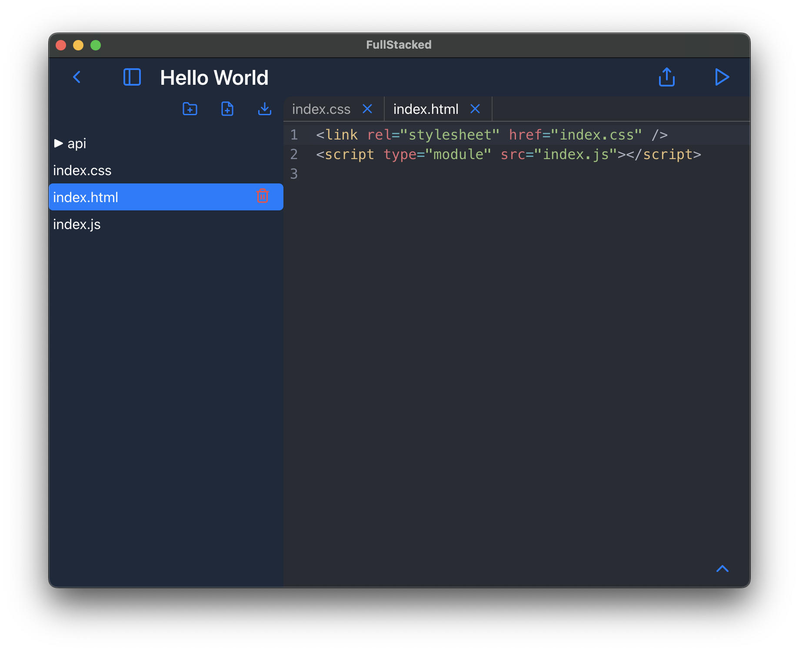
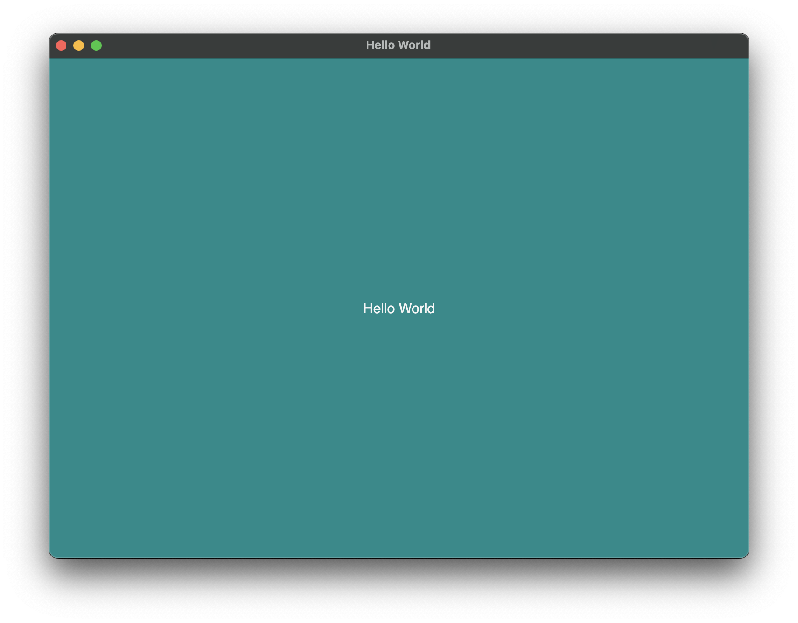

# Getting Started

Once installed, you can now create full-stack web apps within FullStacked.
Follow along to create a `Hello World` project.

## Creating a new project

Start by creating a new project by clicking on the plus `+` tile.



Make sure to add a title to your project and if you'd like, select a location where to store your project directory.



There you go. Your first project is created!



## Editing the WebView

Let's start by creating the WebView JS. That's the context interacting with the DOM.

```js
// index.js
const container = document.createElement("div");
document.body.append(container);
container.innerText = await rpc().greeting("World");
```



Notice that `rpc` call. You'll have to create a `greeting(to: string): string` in your API JS.

## Editing the API

Now let's create your API JS. That's the context interacting with the adapter which access OS-level features.

```js
// api/index.js
export default {
    greeting(to){
        return "Hello " + to;
    }
}
```



## Running your project

We're almost ready to launch your project. 
Just like any other website or web app, you'll need an `index.html` as main starting point.
Let's create it and then add your WebView JS script.

```html
<!-- index.html -->
<script type="module" src="index.js"></script>
```



Now we're ready. Run your project.



## Adding some styling

To spice things up, let's add a bit of styling.
Create a `css` file and add any kind of style attributes you'd like.

```css
/* index.css */
html, body {
    font-family: sans-serif;
    background-color: darkcyan;
    color: whitesmoke;
    height: 100%;
    width: 100%;
    display: flex;
    align-items: center;
    justify-content:center;
}
```



Then make sure to add it to your `index.html`.

```html
<!-- index.html -->
<link rel="stylesheet" href="index.css" />
<script type="module" src="index.js"></script>
```



Rerun your project and voilà!


