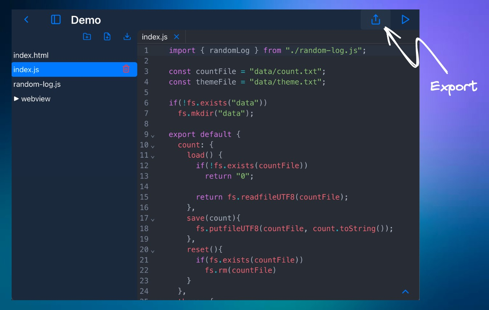
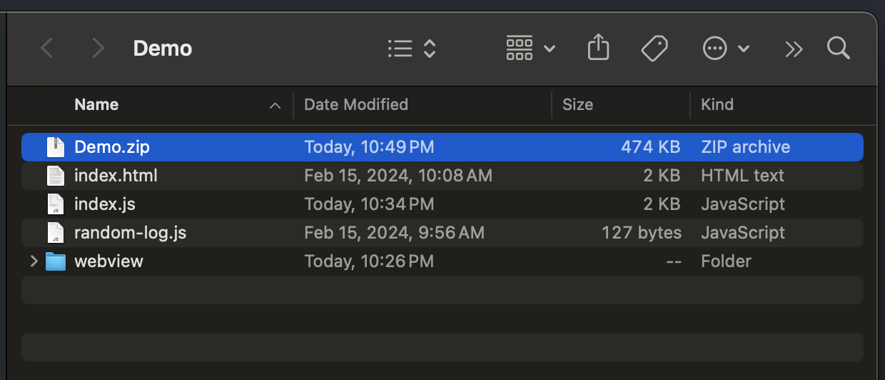
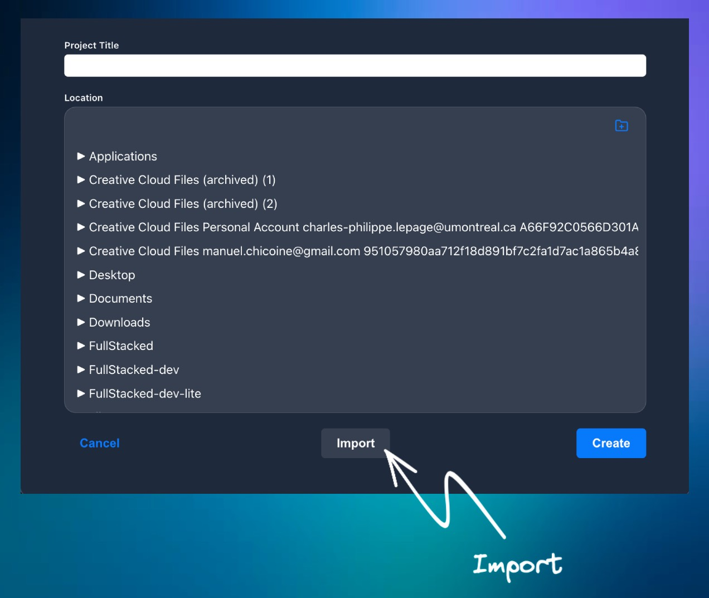
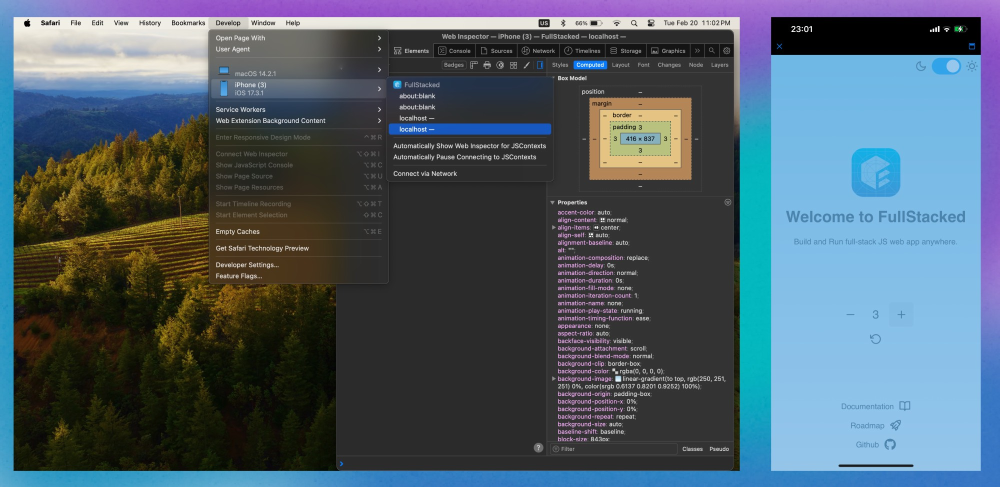
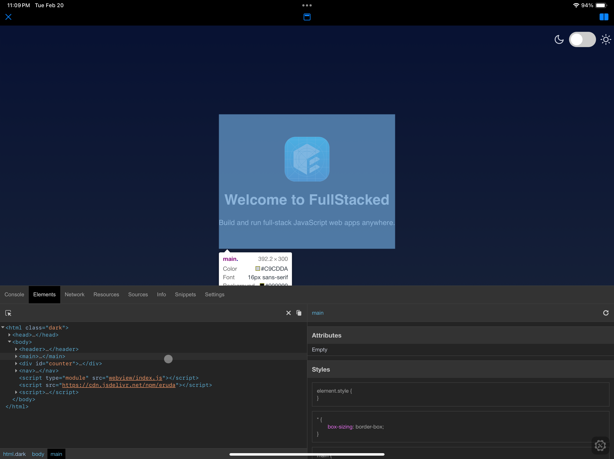

# Guides

## Files Structure

Here's a example of a typical FullStacked project

```
├ api
│ └ index.js <= API JS entrypoint
├ assets
│ ├ image.png
│ └ index.css
├ data <= Data directory
│ └ file.json
├ index.js <= WebView JS entrypoint
├ index.html
└ page
  └ index.html
  
```

### API JS entrypoint

This file is the one that will be bundle and ran in the Business layer JavaScript context. 
Sort of like the backend/server JS part.
It's meant to abstract some OS-level features like fetching from a place, caching and returning
chunks of data.

You must `export default` your methods in the form of an object.
```ts
// api/index.js

export default {
  async foo() {
    const rawData = await fetch.UTF8("https://some.api");
    const data = JSON.parse(rawDate);
    fs.putfileUTF8("data/cache.json", rawData);
    return data.slice(0, 10);
  }
}
```
This object will be merge into the available methods on the `rpc` object.
Learn more about it in the next section.

### WebView JS entrypoint

You can always load script files with a simple `<script src="my-script.js">` tag.
Those won't be bundle or transformed. 
If you use the `index.js`, this file will be bundled before running your app. 
Meaning you can import modules and libraries.
Sort of like your frontend/client JS part.


Take note that this file MUST be added as `type="module"`
```html
<script type="module" src="index.js"></script>
```

### Data directory

This directory is particular because it will not be zipped when you export your app.
It is really intended to just keep your persistent runtime app data which does not need to be shared.

## Using the RPC object

The `rpc` is a function available on the `window` only when you load the WebView JS entrypoint.
It's meant to call your API methods or the ones built-in. 
Once you call the method, a recursive JS proxy will convert your properties getter into a request.
That way you don't have to bother with the fetch syntax and can access OS-level stuff quickly.
Always `await` the function calls on the webview side.

### Example

Fetching data and returning the first 25 elements. Then searching in the whole dataset.
```ts
// api/index.js

const cacheFile = "data/cache.json";
let data;

export default {
  async loadData() {
    let rawData;
    if (fs.exists(cacheFile)) {
      rawData = fs.readfileUTF8(cacheFile);
    } else {
      rawData = await fetch.UTF8("https://some.api");
      fs.putfileUTF8(cacheFile, rawData);
    }

    data = JSON.parse(rawDate);
    return data.slice(0, 25);
  },
  search(str) {
    return data.filter(item => item.includes(str));
  }
}
```

```ts
// index.js
import renderTable from "./table.js"

const resultsElement = document.querySelector("#results");
const firstElements = await rpc().loadData();
resultsElement.innerHTML = renderTable(firstElements);

document.querySelector("input").addEventListener("keyup", async e => {
  const results = await rpc().search(e.currentTarget.value);
  resultsElement.innerHTML = renderTable(results);
});

```

## Export/Import

Once you've built an app inside FullStacked, you can now export it from your device and import it on any other device.
This way, your web app really runs on anywhere.

To export, click the export button in the top-right corner of the Project view.


This will generate a `.zip` of your project. Transfer this to your other device.


To import, create a new project and click the import button.


Give some time to FullStacked to unzip and once ready you'll be back in the Project view, ready to run your project!

## Debugging

### Desktop

Use the built-in chrome debugger by hitting MacOS `cmd` + `alt` + `i` and Win/Linux `ctrl` + `shift` + `i`.

### iOS/iPadOS

There is a small console for logs, but no way of inspecting the rendered HTML.

Here's a few possible approach:
* Connect by usb your device to a Mac computer and debug with Safari debugger tool.

 
* Load [eruda](https://github.com/liriliri/eruda) in your app and pop the mobile inspector.
```html
<script src="https://cdn.jsdelivr.net/npm/eruda"></script>
<script>eruda.init();</script>
```


